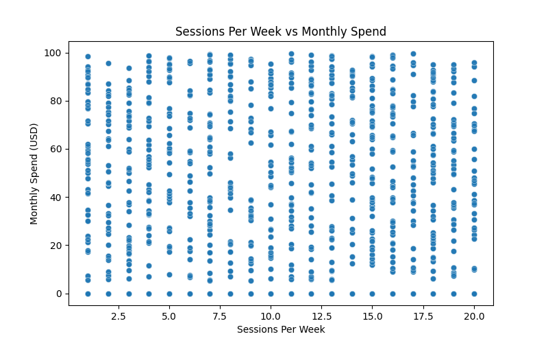

# Exploratory Data Analysis (EDA) Report: Realistic Gaming Player Data

## Introduction
This report provides an exploratory analysis of the gaming player dataset, focusing on demographics, player behaviors, and correlations between key variables. Visualizations are included to support insights and findings.

---

## 1. Demographics Analysis

### Age Distribution

- The age distribution shows the spread of player ages, highlighting the most common age groups among gamers.

### Gender Distribution

- The gender distribution plot reveals the representation of different genders in the dataset.

### Region Distribution

- This chart displays the geographic distribution of players, indicating which regions are most active.

### Platform Distribution

- The platform distribution shows the popularity of different gaming platforms (PC, Console, Mobile) among players.

---

## 2. Behavioral Analysis

### Favorite Game Genre

- This plot highlights the most popular game genres among players.

### Average Session Duration

- The distribution of average session durations provides insight into how long players typically play in a single session.

### Sessions Per Week

- This chart shows how frequently players engage in gaming sessions each week.

### Monthly Spend (USD)

- The monthly spend distribution reveals how much players typically spend on gaming per month.

---

## 3. Correlation Analysis

### Age vs. Monthly Spend

- This scatter plot explores the relationship between player age and monthly gaming spend.

### Sessions Per Week vs. Monthly Spend

- This scatter plot examines whether more frequent play correlates with higher spending.

### Correlation Heatmap

- The heatmap visualizes correlations between numerical variables such as age, session duration, sessions per week, and monthly spend.

---

## 4. Interactive Visualization

- An interactive plotly chart is available for deeper exploration:
  - [Age vs Monthly Spend by Platform (Interactive HTML)](eda_images/age_vs_spend_platform.html)

---

## Summary & Insights
- The dataset reveals diverse player demographics and behaviors.
- Spending patterns and play frequency vary by age, platform, and region.
- Correlation analysis provides clues for targeted marketing and game design.

For further analysis or custom visualizations, refer to the provided Python script. 